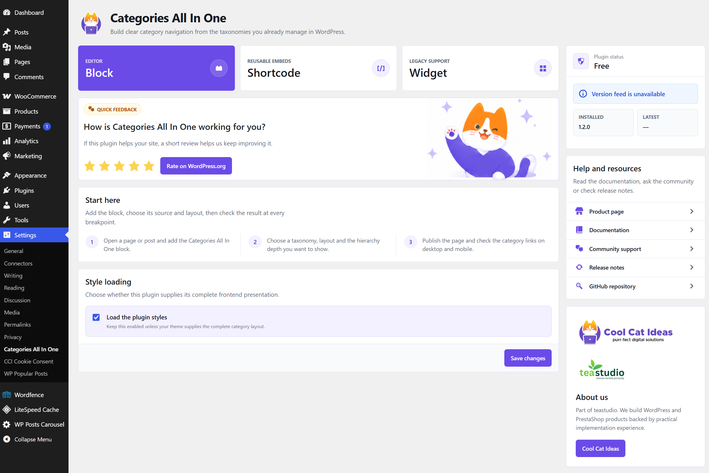
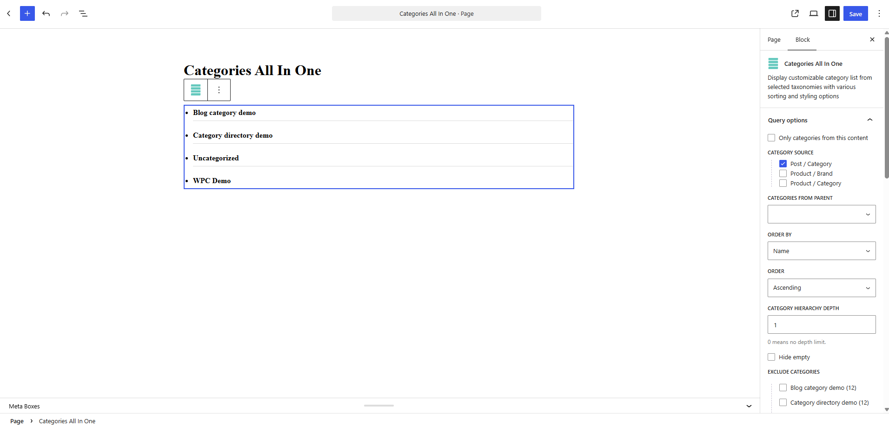
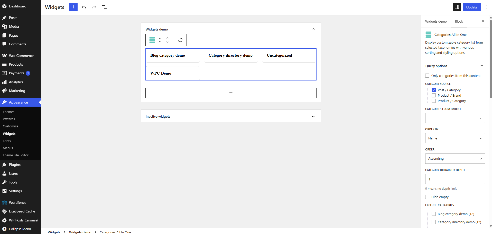
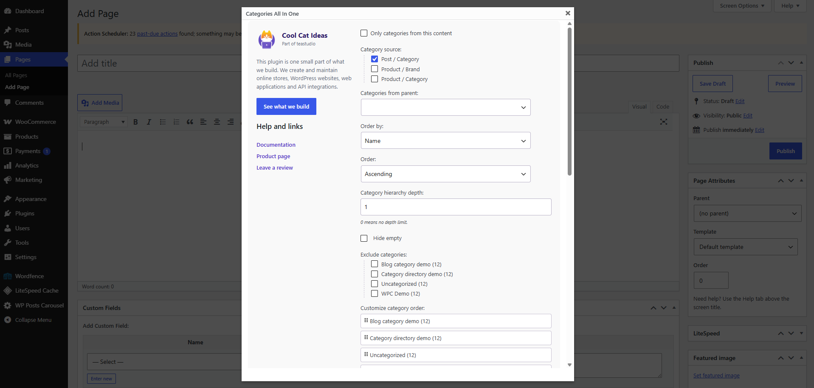
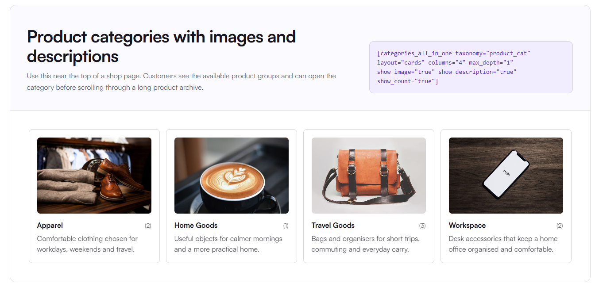
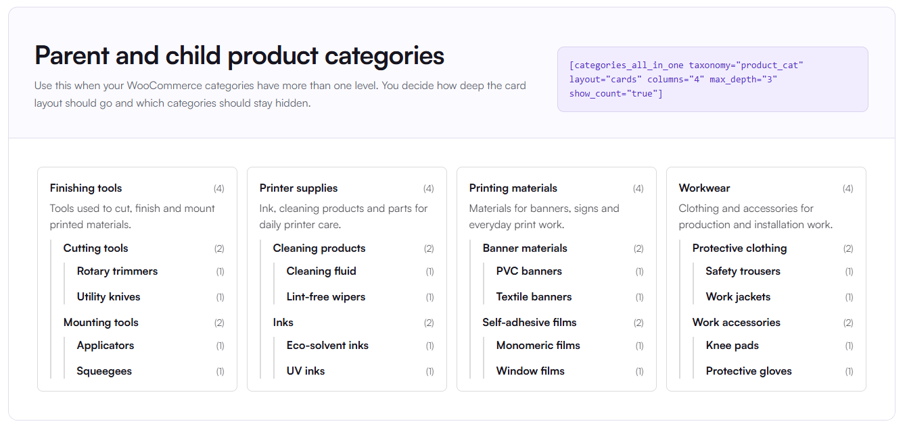
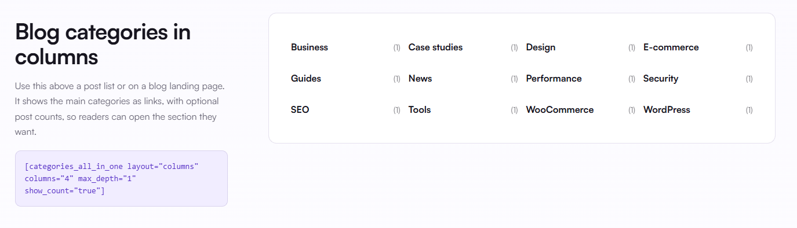

<a href="https://coolcatideas.com/en/products/categories-all-in-one/">
  
</a>

# Categories All In One

Help visitors find posts and products with category lists, columns and cards. Use your existing WordPress categories, WooCommerce product categories or another public hierarchical taxonomy, and add the category section with a block, widget or shortcode.

[Product page](https://coolcatideas.com/en/products/categories-all-in-one/) · [Documentation](https://coolcatideas.com/en/docs/categories-all-in-one/1.2.0/) · [Downloads](https://github.com/cool-cat-ideas/categories-all-in-one/releases) · [Community support](https://github.com/cool-cat-ideas/categories-all-in-one/discussions)

## Get started

Requires **WordPress 6.2 or later** and **PHP 7.4 or later**. WooCommerce is needed only for product categories.

Current release: **1.2.1**. Declared compatibility with **WordPress 7.1.2**. See the [changelog](readme.txt) for style optimizations, fixes and documentation updates.

1. Install the plugin ZIP through **Plugins → Add New Plugin → Upload Plugin** and activate it.
2. Add the **Categories All In One** block to a page or widget area.
3. Choose the category source, layout, order and hierarchy depth, then publish.

You can also use the classic widget or a shortcode. For example, show blog categories in three columns with post counts:

```text
[categories_all_in_one taxonomy="category" layout="columns" columns="3" hide_empty="true" show_count="true"]
```

See [readme.txt](readme.txt) for more examples, frequently asked questions and release notes.

## Screenshots

Expand a screenshot to view it. The examples use demo content; the surrounding page design comes from the theme. Product category examples require WooCommerce and use the store's category images and descriptions.

<details open>
<summary>1. Plugin settings</summary>

Start with the block, widget or shortcode, control frontend style loading, and find version information, documentation and support links. This capture shows the version feed's unavailable state.



</details>

<details>
<summary>2. Gutenberg block settings</summary>

Preview a category list while choosing its taxonomy, parent category, sorting order, hierarchy depth and excluded terms in the block sidebar.



</details>

<details>
<summary>3. Categories in a widget area</summary>

Add the block to a theme's widget area. This example previews category cards in the WordPress widget editor, with the same query settings available in the sidebar.



</details>

<details>
<summary>4. Classic editor shortcode generator</summary>

Open the shortcode generator from the classic editor toolbar. Choose the category source, parent, sorting and hierarchy, exclude terms, or drag categories into a custom order.



</details>

<details>
<summary>5. Product categories with images</summary>

Four WooCommerce category cards show images, descriptions and product counts. Each category links to its archive; the demo also displays the shortcode used for this layout.



</details>

<details>
<summary>6. Parent and child product categories</summary>

Four category cards preserve a three-level product category hierarchy. Indented child links, descriptions and counts help visitors navigate from broad groups to specific categories.



</details>

<details>
<summary>7. Blog categories in columns</summary>

Twelve blog categories are arranged in four columns, with a post count beside each link. The demo includes the shortcode for the columns layout.



</details>

## Publishing screenshots

`README.md` is the GitHub overview. `readme.txt` supplies the WordPress.org description and numbered screenshot captions. Keep the image order and captions aligned.

The seven screenshots are versioned in `.wordpress-org/`. For WordPress.org, copy that directory's contents into the SVN checkout's top-level `assets/` directory, alongside `trunk/` and `tags/`. Do not put the screenshots in `trunk/` or a version tag.

The installable package excludes `.wordpress-org/` and `README.md`; images used by the plugin remain in `images/`. GitHub's source archives are repository snapshots, so use the release ZIP when installing the plugin.

## License

Licensed under [GPL-2.0-or-later](LICENSE).
